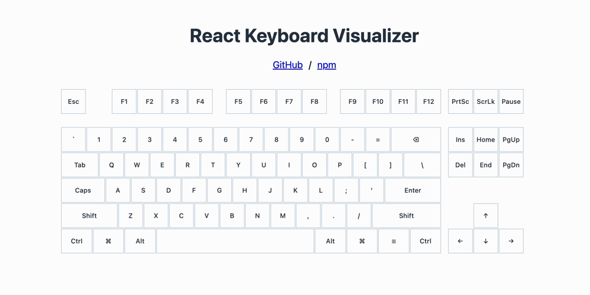

# React Keyboard Visualizer

[](https://badge.fury.io/js/react-keyboard-visualizer)
[](https://github.com/nuskey8/react-keyboard-visualizer/releases)
[](LICENSE)

A keyboard visualizer for React. [Demo](https://nuskey8.github.io/react-keyboard-visualizer)



## Features

- Minimalistic and beautiful keyboard
- Easily adjust style and size
- Zero dependencies
- Supports React 18+

## Usage

```tsx
import KeyboardVisualizer from 'react-keyboard-visualizer'

function App() {
    return (
      <div>
        <KeyboardVisualizer
            listenToKeyboard={true}
        />
      </div>
    )
}

export default App
```

## API

KeyboardVisualizer component props:

- `pressedKeys?: Set<string>` externally controlled set of pressed key codes. If provided, the component becomes controlled for key state.
- `onKeyPress?: (key: string) => void` callback invoked when a key is pressed. Receives the `KeyboardEvent.code` or `KeyboardEvent.key` fallback used by the component.
- `onKeyRelease?: (key: string) => void` callback invoked when a key is released.
- `keySize?: number` size (in pixels) of a single key. Default: `40`.
- `gap?: number` gap (in pixels) between keys. Default: `3`.
- `style?: React.CSSProperties` additional inline styles applied to the keyboard container.
- `className?: string` additional class name applied to the keyboard container.
- `listenToKeyboard?: boolean` whether the component listens to window keyboard events. Default: `true`.

## License

This library is licensed under the [MIT License](./LICENSE).